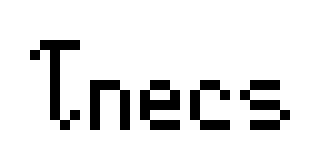

<div align="center">
    
</div>


# tnecs (Tiny nECS) 

Tiny C99 Entity-Component-System (ECS) library. [Read the Tutorial](https://gitlab.com/Gabinou/tnecs/-/blob/master/TUTORIAL.md).

Originally created for use in a game I am developping using C99: [Codename Firesaga](https://gitlab.com/Gabinou/firesagamaker). Title pending. 

ECSs are an alternative way to organize data and functions to Object-Oriented programming (OOP).
* OOP: Objects/Classes contain data and methods. 
Methods act on objects. 
Children classes inherit methods and data structure from parents. 
* ECS: Components are purely data.
Any number of components can be attached to an entity.
Entities are acted upon by systems. 

Videogame Example:
- Enemy Entity: AIControlled component, Sprite Component, Physics Component
- Bullet Entity: Sprite Component, Physics Component, DamageonHit Component
- Main Character Entity: UserControlled Component, Sprite Component, Physics Component

In tnecs, an entity is an ```uint64_t``` index. 
A component is user-defined ```struct```. 
A system is a user-defined ```function```.
All live inside the ```world```, the ```struct tnecs_World```. 

The systems iterate exclusively over the entities that have exactly the user-defined set of components, in phases.
Phases are user-defined ```size_t``` and system execution order is first-come first-served by default.

## To Do:
- Exclusive/Inclusive systems?
Pros:
- Simplify user interface, no need to register same system multiple time for different component combinations
Cons: 
- Complexify the under-the-hood (TNECS_COMPONENT_LIST)-> Does not really matter? My problem?
- Copy components around->Slows performance 
- Systems should loop over number of compatible types instead? Simple. Not really a performance problem.

## Installation
Add ```tnecs.c``` and ```tnecs.h``` to your source code.

## Motivation
Make the _simplest possible_ C99 ECS library, only with the _minimum necessary features_. Compile with ```tcc```.

## Features
- Compatible: compiles with ```tcc```, ```gcc``` and ```clang```
- Cross-platform: Windows, Linux, Android (termux)
- Small: <1300 lines, 2 files.
- Fast: see simple benchmarks in test.c
- Simple: C99 API
- FOSS: Free and Open Source

## Alternative ECS/Gamedev libraries for C/C++
- [flecs (C99/C++)](https://github.com/SanderMertens/flecs)
- [entt (C++)](https://github.com/skypjack/entt)
- [gamedev_libraries](https://github.com/raizam/gamedev_libraries)
- [stb list of single header libraries](https://github.com/nothings/single_file_libs)

## Special Thanks
Sanders Mertens for [his blog on ECS design](https://ajmmertens.medium.com/). 
He created [many other resources on ECSs](). 

## Credits
Copyright (c) 2021 Average Bear Games, Made by Gabriel Taillon
